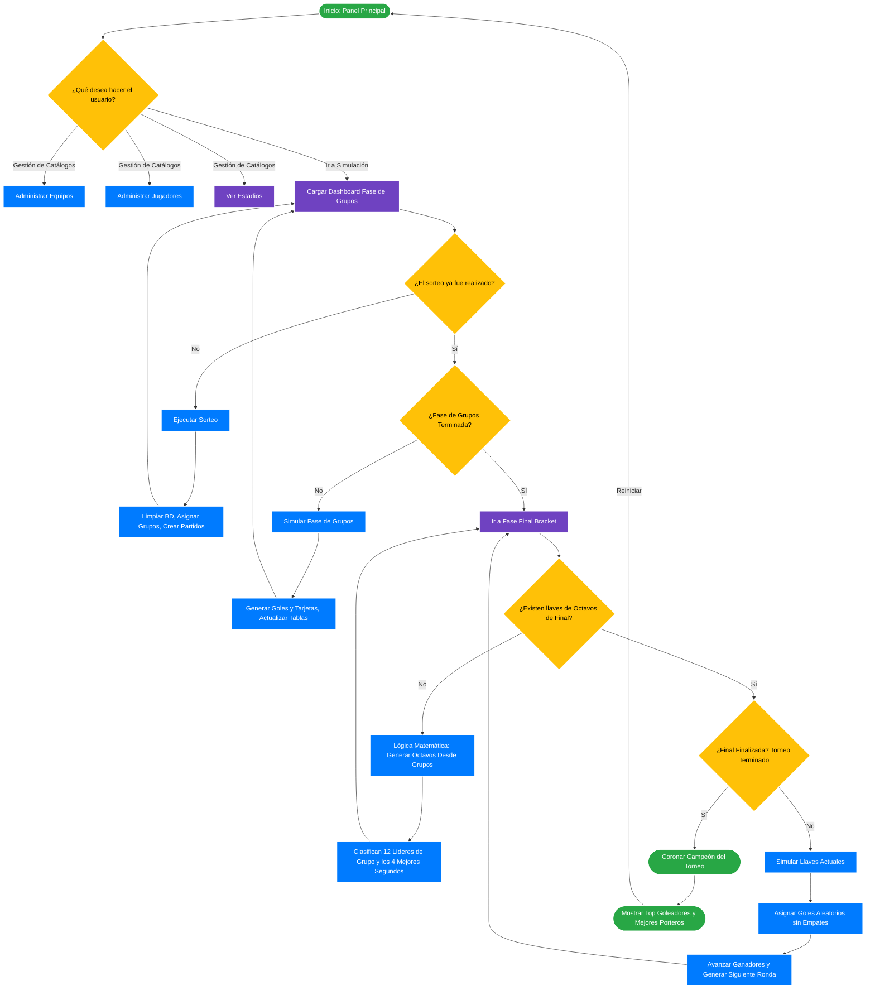

# Diagrama de Flujo: Simulador Mundial UMG

Este archivo contiene el diagrama de flujo lógico del sistema, basado en el controlador de simulación (`SimulacionController.java`) y la gestión de entidades. 
Puedes visualizar el siguiente gráfico usando cualquier visor de Markdown que soporte **Mermaid** (como GitHub o una extensión en VS Code).

